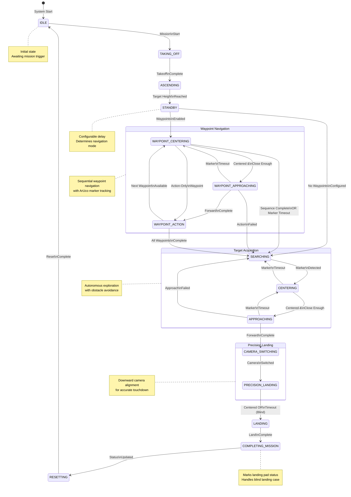

# Autonomous Drone Mission Control State Machine

## State Diagram

## State Transition Table

| Current State | Event/Condition | Next State | Action |
|---------------|-----------------|------------|--------|
| IDLE | Mission start command | TAKING_OFF | Initialize mission context |
| TAKING_OFF | Takeoff complete / Already airborne | ASCENDING | Execute takeoff command |
| ASCENDING | Height ≥ initial_search_height | STANDBY | Ascend at configured speed |
| STANDBY | Delay elapsed ∧ Waypoints enabled | WAYPOINT_CENTERING | Wait for standby_delay |
| STANDBY | Delay elapsed ∧ No waypoints | SEARCHING | Wait for standby_delay |
| WAYPOINT_CENTERING | Marker centered ∧ Close enough | WAYPOINT_APPROACHING | Yaw alignment with obstacle avoidance |
| WAYPOINT_CENTERING | Action-only waypoint | WAYPOINT_ACTION | Skip navigation |
| WAYPOINT_CENTERING | Sequence complete ∨ Timeout | SEARCHING | Handle marker loss |
| WAYPOINT_APPROACHING | Forward movement complete | WAYPOINT_ACTION | Move toward waypoint marker |
| WAYPOINT_APPROACHING | Marker timeout | WAYPOINT_CENTERING | Re-acquire marker |
| WAYPOINT_APPROACHING | Action failed | SEARCHING | Handle failure |
| WAYPOINT_ACTION | Next waypoint available | WAYPOINT_CENTERING | Execute post-action, advance waypoint |
| WAYPOINT_ACTION | All waypoints complete | SEARCHING | Complete waypoint sequence |
| SEARCHING | Landing marker detected | CENTERING | Autonomous exploration with obstacle avoidance |
| CENTERING | Marker centered ∧ Close enough | APPROACHING | Yaw alignment on target marker |
| CENTERING | Marker timeout | SEARCHING | Re-enter search mode |
| APPROACHING | Forward movement complete | CAMERA_SWITCHING | Move toward landing marker |
| APPROACHING | Marker timeout | CENTERING | Re-acquire marker |
| APPROACHING | Approach failed | SEARCHING | Handle failure |
| CAMERA_SWITCHING | Camera switched | PRECISION_LANDING | Switch to downward camera |
| PRECISION_LANDING | X,Y centered | LANDING | Fine positioning over marker |
| PRECISION_LANDING | Full timeout | LANDING | Blind landing triggered |
| LANDING | Land complete / Already landed | COMPLETING_MISSION | Execute land command |
| COMPLETING_MISSION | Status updated | RESETTING | Mark marker as landed |
| RESETTING | Reset complete | IDLE | Reset context, switch camera |

## State Descriptions

### Startup Phase
- **IDLE (S0)**: Initial dormant state awaiting mission activation
- **TAKING_OFF (S1)**: Executes takeoff command until airborne
- **ASCENDING (S2)**: Climbs to configured initial search altitude
- **STANDBY (S3)**: Configurable delay period; determines navigation mode

### Waypoint Navigation Phase
- **WAYPOINT_CENTERING (S4)**: Aligns yaw with waypoint marker while avoiding obstacles
- **WAYPOINT_APPROACHING (S5)**: Executes forward movement toward waypoint marker
- **WAYPOINT_ACTION (S6)**: Executes waypoint-specific actions; advances sequence

### Target Acquisition Phase
- **SEARCHING (S7)**: Autonomous exploration with depth-based obstacle avoidance
- **CENTERING (S9)**: Yaw alignment on detected landing marker
- **APPROACHING (S10)**: Forward movement toward landing marker

### Precision Landing Phase
- **CAMERA_SWITCHING (S11)**: Transitions to downward-facing camera
- **PRECISION_LANDING (S12)**: X-Y alignment over marker using proportional control
- **LANDING (S13)**: Executes landing command

### Mission Completion Phase
- **COMPLETING_MISSION (S14)**: Updates marker landing status
- **RESETTING (S15)**: Resets all state; returns to IDLE

---
