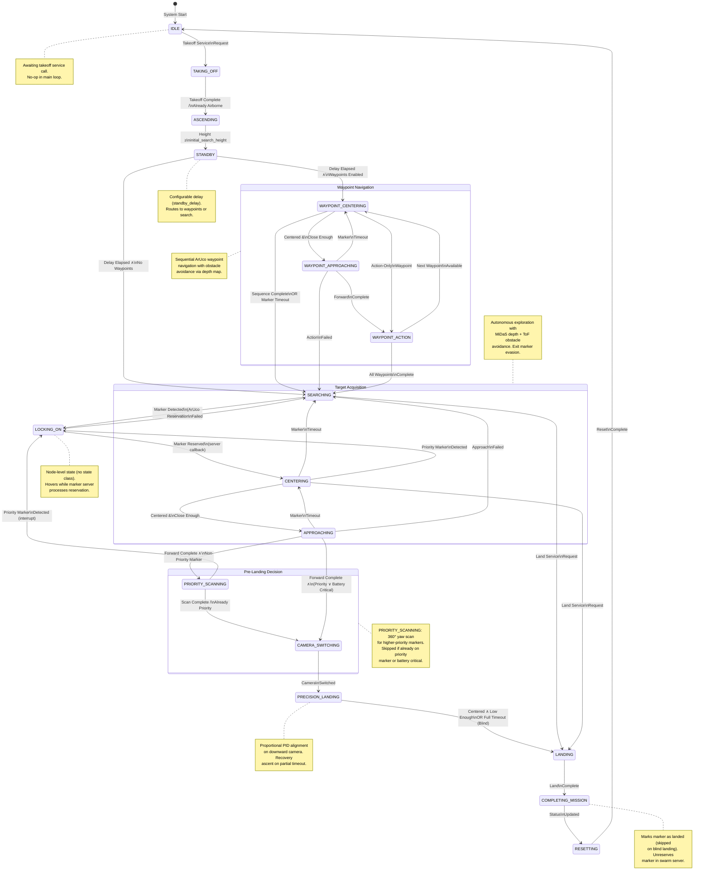

# Autonomous Drone Mission Control State Machine

> **Auto-generated reference** — keep in sync with the implementation in
> `mission_control/state_machine/` and `mission_control_node.py`.

---

## State Diagram

```mermaid
stateDiagram-v2
    direction TB

    %% ========================================
    %% STATE DEFINITIONS
    %% ========================================

    [*] --> IDLE : System Start

    state "IDLE" as IDLE
    state "TAKING_OFF" as TAKING_OFF
    state "ASCENDING" as ASCENDING
    state "STANDBY" as STANDBY

    state "Waypoint Navigation" as WaypointNav {
        direction LR
        state "WAYPOINT_CENTERING" as WP_CENTER
        state "WAYPOINT_APPROACHING" as WP_APPROACH
        state "WAYPOINT_ACTION" as WP_ACTION

        WP_CENTER --> WP_APPROACH : Centered &\nClose Enough
        WP_APPROACH --> WP_ACTION : Forward\nComplete
        WP_APPROACH --> WP_CENTER : Marker\nTimeout
        WP_ACTION --> WP_CENTER : Next Waypoint\nAvailable
    }

    state "LOCKING_ON" as LOCKING_ON

    state "Target Acquisition" as TargetAcq {
        direction LR
        state "SEARCHING" as SEARCHING
        state "CENTERING" as CENTERING
        state "APPROACHING" as APPROACHING

        CENTERING --> APPROACHING : Centered &\nClose Enough
        CENTERING --> SEARCHING : Marker\nTimeout
        APPROACHING --> CENTERING : Marker\nTimeout
    }

    state "Pre-Landing Decision" as PreLand {
        direction LR
        state "PRIORITY_SCANNING" as PRIO_SCAN
        state "CAMERA_SWITCHING" as CAM_SWITCH

        PRIO_SCAN --> CAM_SWITCH : Scan Complete /\nAlready Priority
    }

    state "PRECISION_LANDING" as PREC_LAND
    state "LANDING" as LANDING
    state "COMPLETING_MISSION" as COMPLETING
    state "RESETTING" as RESETTING

    %% ========================================
    %% MAIN STATE TRANSITIONS
    %% ========================================

    %% Startup Sequence
    IDLE --> TAKING_OFF : Takeoff Service\nRequest
    TAKING_OFF --> ASCENDING : Takeoff Complete /\nAlready Airborne
    ASCENDING --> STANDBY : Height ≥\ninitial_search_height

    %% Standby Transitions
    STANDBY --> WP_CENTER : Delay Elapsed ∧\nWaypoints Enabled
    STANDBY --> SEARCHING : Delay Elapsed ∧\nNo Waypoints

    %% Waypoint to Search Transitions
    WP_CENTER --> SEARCHING : Sequence Complete\nOR Marker Timeout
    WP_CENTER --> WP_ACTION : Action-Only\nWaypoint
    WP_APPROACH --> SEARCHING : Action\nFailed
    WP_ACTION --> SEARCHING : All Waypoints\nComplete

    %% Marker Locking (node-level, async)
    SEARCHING --> LOCKING_ON : Marker Detected\n(ArUco callback)
    CENTERING --> LOCKING_ON : Priority Marker\nDetected
    PRIO_SCAN --> LOCKING_ON : Priority Marker\nDetected (interrupt)
    LOCKING_ON --> CENTERING : Marker Reserved\n(server callback)
    LOCKING_ON --> SEARCHING : Reservation\nFailed

    %% Target Acquisition to Pre-Landing
    APPROACHING --> PRIO_SCAN : Forward Complete ∧\nNon-Priority Marker
    APPROACHING --> CAM_SWITCH : Forward Complete ∧\n(Priority ∨ Battery Critical)
    APPROACHING --> SEARCHING : Approach\nFailed

    %% Pre-Landing to Precision Landing
    CAM_SWITCH --> PREC_LAND : Camera\nSwitched

    %% Precision Landing to Landing
    PREC_LAND --> LANDING : Centered ∧ Low Enough\nOR Full Timeout (Blind)

    %% Mission Completion
    LANDING --> COMPLETING : Land\nComplete
    COMPLETING --> RESETTING : Status\nUpdated
    RESETTING --> IDLE : Reset\nComplete

    %% External Emergency Landing (any active state)
    SEARCHING --> LANDING : Land Service\nRequest
    CENTERING --> LANDING : Land Service\nRequest

    %% ========================================
    %% NOTES
    %% ========================================

    note right of IDLE
        Awaiting takeoff service call.
        No-op in main loop.
    end note

    note right of STANDBY
        Configurable delay (standby_delay).
        Routes to waypoints or search.
    end note

    note right of LOCKING_ON
        Node-level state (no state class).
        Hovers while marker server
        processes reservation.
    end note

    note right of WaypointNav
        Sequential ArUco waypoint
        navigation with obstacle
        avoidance via depth map.
    end note

    note left of TargetAcq
        Autonomous exploration with
        MiDaS depth + ToF obstacle
        avoidance. Exit marker evasion.
    end note

    note right of PreLand
        PRIORITY_SCANNING: 360° yaw scan
        for higher-priority markers.
        Skipped if already on priority
        marker or battery critical.
    end note

    note right of PREC_LAND
        Proportional PID alignment
        on downward camera. Recovery
        ascent on partial timeout.
    end note

    note right of COMPLETING
        Marks marker as landed (skipped
        on blind landing). Unreserves
        marker in swarm server.
    end note
```

---

## State Transition Table

| # | Current State | Event / Condition | Next State | Action |
|---|---------------|-------------------|------------|--------|
| | **Startup Phase** | | | |
| 1 | IDLE | Takeoff service request | TAKING_OFF | Validate state is IDLE |
| 2 | TAKING_OFF | Takeoff complete / already airborne | ASCENDING | `drone.execute_action('takeoff')` |
| 3 | ASCENDING | `latest_height ≥ initial_search_height` | STANDBY | Ascend at `ascending_speed` |
| 4 | STANDBY | `standby_delay` elapsed ∧ waypoints enabled | WAYPOINT_CENTERING | Initialize `standby_start_time` |
| 5 | STANDBY | `standby_delay` elapsed ∧ no waypoints | SEARCHING | Initialize `standby_start_time` |
| | **Waypoint Navigation Phase** | | | |
| 6 | WAYPOINT_CENTERING | Marker centered ∧ close enough | WAYPOINT_APPROACHING | Yaw alignment + obstacle avoidance |
| 7 | WAYPOINT_CENTERING | Action-only waypoint (`id:none`) | WAYPOINT_ACTION | Skip marker navigation |
| 8 | WAYPOINT_CENTERING | Sequence complete ∨ marker timeout | SEARCHING | Handle marker loss |
| 9 | WAYPOINT_APPROACHING | Forward movement complete | WAYPOINT_ACTION | `execute_action('forward')` |
| 10 | WAYPOINT_APPROACHING | Sequence complete (defensive) | SEARCHING | Guard check |
| 11 | WAYPOINT_APPROACHING | Marker timeout | WAYPOINT_CENTERING | Re-acquire marker |
| 12 | WAYPOINT_APPROACHING | Action failed | SEARCHING | Fallback from `execute_action` |
| 13 | WAYPOINT_ACTION | Next waypoint available | WAYPOINT_CENTERING | Execute post-action, `advance()` |
| 14 | WAYPOINT_ACTION | All waypoints complete | SEARCHING | Final post-action (if any) |
| 15 | WAYPOINT_ACTION | No current waypoint (defensive) | SEARCHING | Guard check |
| | **Target Acquisition Phase** | | | |
| 16 | SEARCHING | Landing marker detected (ArUco cb) | LOCKING_ON | `process_aruco_detection_for_search()`, cancel yaw |
| 17 | SEARCHING | Exit marker proximity detected | *(stay)* | Set `is_near_exit = True` → 90° avoidance turn |
| 18 | LOCKING_ON | Marker reservation succeeded (async cb) | CENTERING | `_on_marker_locked` callback |
| 19 | LOCKING_ON | Marker reservation failed (async cb) | SEARCHING | `_on_marker_lost` callback |
| 20 | CENTERING | Marker centered ∧ close enough | APPROACHING | Yaw alignment + forward creep |
| 21 | CENTERING | Priority marker visible (ArUco cb) | LOCKING_ON | `should_switch_to_priority_marker()` |
| 22 | CENTERING | Marker timeout > `marker_timeout` | SEARCHING | Unreserve marker |
| 23 | APPROACHING | Forward complete ∧ priority marker / battery critical | CAMERA_SWITCHING | `execute_action('forward', CAMERA_SWITCHING)` |
| 24 | APPROACHING | Forward complete ∧ non-priority marker | PRIORITY_SCANNING | `execute_action('forward', PRIORITY_SCANNING)` |
| 25 | APPROACHING | Marker timeout | CENTERING | Re-acquire marker |
| 26 | APPROACHING | Action failed | SEARCHING | Fallback from `execute_action` |
| 27 | APPROACHING | Marker temporarily lost | *(stay)* | Hover in place |
| | **Pre-Landing Phase** | | | |
| 28 | PRIORITY_SCANNING | Already on priority marker | CAMERA_SWITCHING | Skip scan |
| 29 | PRIORITY_SCANNING | 360° scan complete, no better target | CAMERA_SWITCHING | `yaw_right_by_angle(360)` |
| 30 | PRIORITY_SCANNING | Priority marker detected during scan (ArUco cb) | LOCKING_ON | Cancel yaw, switch target |
| 31 | CAMERA_SWITCHING | Camera switched to downward | PRECISION_LANDING | `execute_action('downvision 1')` |
| | **Precision Landing Phase** | | | |
| 32 | PRECISION_LANDING | X,Y centered ∧ `height ≤ landing_height_threshold` | LANDING | `is_blind_landing = False` |
| 33 | PRECISION_LANDING | Centered ∧ too high | *(stay)* | Descend at `descending_speed` |
| 34 | PRECISION_LANDING | Not centered | *(stay)* | Proportional PID alignment (`precision_*_kp`) |
| 35 | PRECISION_LANDING | Partial timeout ∧ low altitude | *(stay)* | Recovery: ascend to `recovery_height` |
| 36 | PRECISION_LANDING | Full timeout (`precision_landing_timeout`) | LANDING | `is_blind_landing = True` |
| | **Mission Completion Phase** | | | |
| 37 | LANDING | Land complete / already landed | COMPLETING_MISSION | `execute_action('land')` |
| 38 | COMPLETING_MISSION | Not blind landing | RESETTING | Mark marker as landed in swarm server |
| 39 | COMPLETING_MISSION | Blind landing | RESETTING | Skip marker status update |
| 40 | RESETTING | Reset complete | IDLE | `context.reset()`, `execute_action('downvision 0')` |
| | **External Service Triggers** | | | |
| 41 | *Any active state* | Land service request | LANDING | Emergency landing override |
| 42 | IDLE | Takeoff service request | TAKING_OFF | Mission initiation |

---

## State Descriptions

### Startup Phase

- **IDLE (S0)**: Dormant state. The main loop is a no-op. Transitions only via the `/takeoff` service.
- **TAKING_OFF (S1)**: Issues the SDK `takeoff` command. If the drone is already airborne (height ≥ `min_takeoff_height`), skips directly to ASCENDING.
- **ASCENDING (S2)**: Climbs at `ascending_speed` until `latest_height ≥ initial_search_height`.
- **STANDBY (S3)**: Waits for `standby_delay` seconds (staggered takeoff in swarm scenarios), then routes to WAYPOINT_CENTERING or SEARCHING based on `enable_waypoint_navigation`.

### Waypoint Navigation Phase

- **WAYPOINT_CENTERING (S4)**: Aligns yaw with the current waypoint's ArUco marker while performing depth-based obstacle avoidance. Action-only waypoints (`id:none`) bypass navigation and jump to WAYPOINT_ACTION.
- **WAYPOINT_APPROACHING (S5)**: Executes a forward movement toward the waypoint marker. On marker timeout, falls back to WAYPOINT_CENTERING for re-acquisition.
- **WAYPOINT_ACTION (S6)**: Executes the waypoint's post-arrival action (e.g., `ccw 90`, `forward 50`). Rotation commands use `yaw_right_by_angle`/`yaw_left_by_angle`; linear commands use `execute_action`. Advances the waypoint sequence on completion.

### Target Acquisition Phase

- **SEARCHING (S7)**: Autonomous exploration using a layered obstacle avoidance strategy:
  1. **Exit marker avoidance** — 90° clockwise turn when `is_near_exit` is set.
  2. **Depth map obstacle** — yaw toward clearer side when center red > center blue.
  3. **Corner detection** — 137° turn when depth is clear but ToF ≤ `corner_tof_threshold`.
  4. **Head-on obstacle** — 180° turn when ToF ≤ `headon_tof_threshold`.
  5. **Path clear** — move forward at `forward_speed`.

  Marker detection is handled at the node level in `_aruco_callback`, not within the state class.

- **LOCKING_ON (S8)**: A node-level transient state (no `BaseState` subclass). The drone hovers while the `ArucoMarkerHandler` asynchronously contacts the swarm marker server (`/reserve_marker`) to reserve the detected marker. Resolves to CENTERING on success or SEARCHING on failure via callbacks.

- **CENTERING (S9)**: Yaw alignment on the reserved landing marker. Creeps forward while centering. If a higher-priority marker is detected in the ArUco callback, transitions to LOCKING_ON to switch targets.

- **APPROACHING (S10)**: Computes forward distance from the marker's z-position minus `final_approach_offset` and issues an `execute_action('forward')`. The next state branches:
  - **Priority marker** or **battery critical** → CAMERA_SWITCHING (skip scan).
  - **Non-priority marker** → PRIORITY_SCANNING (360° scan first).
  On marker timeout, returns to CENTERING for re-acquisition.

### Pre-Landing Phase

- **PRIORITY_SCANNING (S16)**: Performs a 360° yaw scan at `scanning_yaw_speed` to detect higher-priority markers before committing to landing. If a priority marker is detected during the scan (via `_aruco_callback`), the yaw is cancelled and the drone transitions to LOCKING_ON. If no better target is found, proceeds to CAMERA_SWITCHING. Skipped entirely if already on a priority marker or battery is critical.

- **CAMERA_SWITCHING (S11)**: Issues `downvision 1` to switch to the downward-facing camera (Tello EDU only). Retries on failure.

### Precision Landing Phase

- **PRECISION_LANDING (S12)**: Fine-tuned X-Y alignment over the marker using proportional control (`precision_forward_kp`, `precision_sideway_kp`). Features:
  - **Initialization**: resets marker timeout after camera switch (handles gap from PRIORITY_SCANNING).
  - **Descent**: once centered, descends at `descending_speed` until `height ≤ landing_height_threshold`.
  - **Recovery ascent**: if marker is lost for > half the timeout at low altitude, ascends to `recovery_height`.
  - **Blind landing**: if marker is lost for the full `precision_landing_timeout`, lands without confirmation (`is_blind_landing = True`).

- **LANDING (S13)**: Issues the SDK `land` command. Also reachable via the `/land` service from any active state (emergency override).

### Mission Completion Phase

- **COMPLETING_MISSION (S14)**: If `is_blind_landing` is false, marks the marker as successfully landed in the swarm marker server. If blind, skips the status update. Always transitions to RESETTING.
- **RESETTING (S15)**: Calls `context.reset()` to clear all shared state, resets marker handler, and switches the camera back to forward-facing (`downvision 0`). Transitions to IDLE regardless of success or failure.

---

## Execution Architecture

### Main Control Loop (4 Hz)

The `_main_logic_loop` in `mission_control_node.py` runs at 4 Hz and follows this priority order:

1. **Publish state** — emits `mission_state` topic on transitions (transient local QoS).
2. **Check timeouts** — `drone.check_timeout()` and `drone.check_yaw_progress()`.
3. **Busy guard** — skip if `drone.is_busy()` (action or yaw in progress).
4. **LOCKING_ON** — hover and wait (no state class, no delegation).
5. **IDLE** — no-op.
6. **Delegate** — `mission_manager.execute_state(state)` → returns `Optional[MissionState]`.

### Node-Level vs State-Level Transitions

| Mechanism | Handled By | Examples |
|-----------|-----------|---------|
| `execute()` return value | State class → `MissionManager` | ASCENDING→STANDBY, CENTERING→APPROACHING |
| `_aruco_callback` | Node (MissionControl) | SEARCHING→LOCKING_ON, CENTERING→LOCKING_ON, PRIORITY_SCANNING→LOCKING_ON |
| Async action callbacks | Node (`_on_action_success/fail`) | TAKING_OFF→ASCENDING, APPROACHING→CAMERA_SWITCHING |
| Marker handler callbacks | Node (`_on_marker_locked/lost`) | LOCKING_ON→CENTERING, LOCKING_ON→SEARCHING |
| Service handlers | Node | IDLE→TAKING_OFF, *→LANDING |

### Marker Reservation Heartbeat

During states CENTERING, APPROACHING, CAMERA_SWITCHING, PRIORITY_SCANNING, PRECISION_LANDING, and LANDING, the node renews the marker reservation every 2 seconds via `_renew_marker_reservation()`. Reservations in the swarm marker server expire after ~6–8 seconds without renewal.

---
